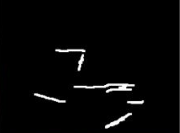

# 🎨 Image Inpainting using Stable Diffusion

## 🚀 Live Demo (Google Colab)

👉 [Run this project on Google Colab](https://colab.research.google.com/drive/132Oeq4rRKaQ6GhblgENZVEoUTP2EXzc2)

---

## 🧠 Overview

This project implements a **text-guided image inpainting system** using the **Stable Diffusion Inpainting Pipeline** from Hugging Face.

It allows users to **restore or modify specific regions of an image** by:

* Providing a **mask image**
* Giving a **text prompt** to guide generation

The model generates **photorealistic and context-aware content** within the masked region.

---

## ✨ Key Features

* 🎯 Text-controlled image generation
* 🧩 Mask-based region editing
* 🧠 Semantic understanding using CLIP
* 🖼️ High-quality photorealistic outputs
* ⚡ GPU-accelerated inference using PyTorch

---

## ⚙️ How It Works

1. Upload an **original image**
2. Upload a **mask image**

   * White area → will be replaced
   * Black area → preserved
3. Enter a **text prompt** describing desired output
4. Model generates realistic content in masked region

---

## 🏗️ Model Architecture

This project uses:

* **Stable Diffusion Inpainting Pipeline**

  * Model: `runwayml/stable-diffusion-inpainting`
* **CLIP Text Encoder** → understands prompts
* **U-Net** → generates new content
* **VAE** → encodes and decodes images

💡 The model works in a **latent space**, making it efficient and scalable.

---

## 🛠️ Tech Stack

* Python
* PyTorch
* Hugging Face Diffusers
* Transformers
* Pillow (PIL)
* Google Colab (GPU)

---

## 📌 Key Parameters

| Parameter       | Value | Description                |
| --------------- | ----- | -------------------------- |
| Guidance Scale  | 7.5   | Controls prompt adherence  |
| Inference Steps | 50    | Quality vs speed trade-off |
| Seed            | 42    | Ensures reproducibility    |

---

## 🧪 Sample Output

| Origin
al Image                | Mask    
                     | Inpainted Result               |
| ----------------------------- | ---------------------------- | -----------------
------------- |
|  |  |  |

---

## ▶️ Installation

```bash
pip install diffusers transformers accelerate torch torchvision pillow
```

---

## ▶️ Usage

Run the notebook in **Google Colab with GPU enabled**.

Steps:

* Execute setup cell
* Upload image and mask
* Modify prompt if needed
* Run inference

---

## 💡 Example Prompt

```text
photorealistic restoration, high quality, detailed, natural lighting
```

---

## ⚠️ Notes

* Mask must be **black & white**

  * White → region to modify
* Recommended resolution: **512 × 512**
* GPU is required for faster execution

---

## 📈 Results

* Produces **high-quality photorealistic restoration**
* Maintains **contextual consistency**
* Allows **controlled generation via text prompts**

---

## 📄 Project Report

Detailed explanation available in:
📄 `report.pdf`

---

## 🚀 Future Improvements

* Integration with Segment Anything Model (SAM)
* Support for Stable Diffusion XL
* Web interface (Streamlit / Flask)
* Real-time inpainting UI

---

## 👩‍💻 Author

**Anna Angel Raju**
B.Tech Computer Science

---
